# Project Structure

## Terminal-style project tree

```terminal
ng-template-one/               # Root repository folder
├── angular.json               # Angular CLI workspace configuration
├── package.json               # Project dependencies and scripts
├── pnpm-lock.yaml             # Locked package versions for pnpm
├── pnpm-workspace.yaml        # pnpm monorepo workspace settings
├── README.md                  # Project overview and usage notes
├── TODO.md                    # Planned tasks and improvement notes
├── tsconfig.json              # Base TypeScript compiler configuration
├── tsconfig.app.json          # App-specific TypeScript config
├── tsconfig.spec.json         # Test-specific TypeScript config
├── docs/                      # Documentation content and guides
│   ├── content/               # General documentation content
│   └── v20.3.x/               # Versioned Angular docs and examples
└── src/                       # Application source files
    ├── index.html             # App shell HTML entry point
    ├── main.ts                # Angular bootstrap entry point
    ├── styles.css             # Global stylesheet
    ├── app/                   # Main Angular app module files
    │   ├── app.component.ts   # App root component logic
    │   ├── app.component.html # App root component template
    │   ├── app.component.css  # App root component styles
    │   ├── app.component.spec.ts # App component unit tests
    │   ├── app.config.ts      # App configuration settings
    │   ├── app.routes.ts      # App routing definitions
    │   ├── core/              # Core utilities, guards, interceptors, services
    │   │   ├── guards/        # Route guard implementations
    │   │   ├── interceptors/  # HTTP interceptors
    │   │   ├── models/        # Shared data models and interfaces
    │   │   └── services/      # Reusable core services
    │   ├── features/          # Feature modules and lazy-loaded pages
    │   │   ├── admin/         # Admin area components and pages
    │   │   ├── articles/      # Articles list and detail pages
    │   │   └── auth/          # Authentication pages and logic
    │   └── shared/            # Shared UI components
    │       └── components/    # Reusable shared components
    └── assets/                # Static assets such as images and fonts
```

## Mermaid diagram

```mermaid
flowchart TD
    classDef root fill:#020617,stroke:#38bdf8,stroke-width:2px,color:#f8fafc;
    classDef group fill:#0b1220,stroke:#60a5fa,stroke-width:1.5px,color:#e2e8f0;
    classDef leaf fill:#111827,stroke:#22c55e,stroke-width:1px,color:#f8fafc;
    classDef accent fill:#0f172a,stroke:#f59e0b,stroke-width:1.5px,color:#fef3c7;
    classDef box fill:#020617,stroke:#64748b,stroke-width:1px,color:#cbd5e1;

    subgraph Project[Project Root]
        direction TB
        A["ng-template-one"]:::root
        B["docs"]:::group
        C["src"]:::group
        D["config files"]:::accent
        A --> B
        A --> C
        A --> D
    end

    linkStyle default stroke:#22c55e,stroke-width:1.5px

    subgraph SourceFiles[Source Files]
        direction LR
        C1["index.html"]:::leaf
        C2["main.ts"]:::leaf
        C3["styles.css"]:::leaf
        C4["app"]:::group
        C5["assets"]:::leaf
        C --> C1
        C --> C2
        C --> C3
        C --> C4
        C --> C5
    end

    subgraph AppStructure[Application Structure]
        direction LR
        C4a["app component"]:::leaf
        C4b["app routes"]:::leaf
        C4c["core"]:::group
        C4d["features"]:::group
        C4e["shared"]:::group
        C4 --> C4a
        C4 --> C4b
        C4 --> C4c
        C4 --> C4d
        C4 --> C4e
    end

    subgraph CoreModules[Core Modules]
        direction LR
        C4c1["guards"]:::leaf
        C4c2["interceptors"]:::leaf
        C4c3["models"]:::leaf
        C4c4["services"]:::leaf
        C4c --> C4c1
        C4c --> C4c2
        C4c --> C4c3
        C4c --> C4c4
    end

    subgraph FeatureModules[Feature Modules]
        direction LR
        C4d1["admin"]:::leaf
        C4d2["articles"]:::leaf
        C4d3["auth"]:::leaf
        C4d --> C4d1
        C4d --> C4d2
        C4d --> C4d3
    end

    subgraph SharedUI[Shared UI]
        direction LR
        C4e1["components"]:::leaf
        C4e --> C4e1
    end

    style Project fill:#020617,stroke:#0f172a,stroke-width:1px
    style SourceFiles fill:#020617,stroke:#0f172a,stroke-width:1px
    style AppStructure fill:#020617,stroke:#0f172a,stroke-width:1px
    style CoreModules fill:#020617,stroke:#0f172a,stroke-width:1px
    style FeatureModules fill:#020617,stroke:#0f172a,stroke-width:1px
    style SharedUI fill:#020617,stroke:#0f172a,stroke-width:1px
```


